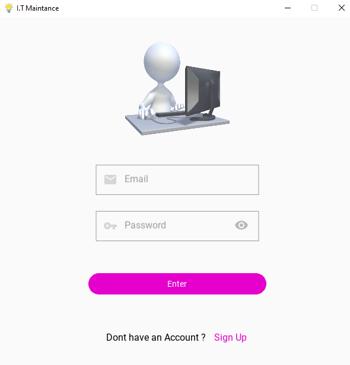
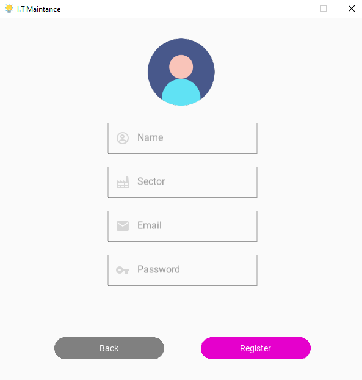
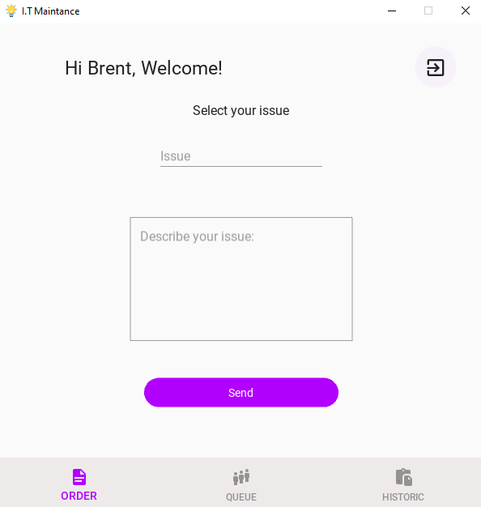
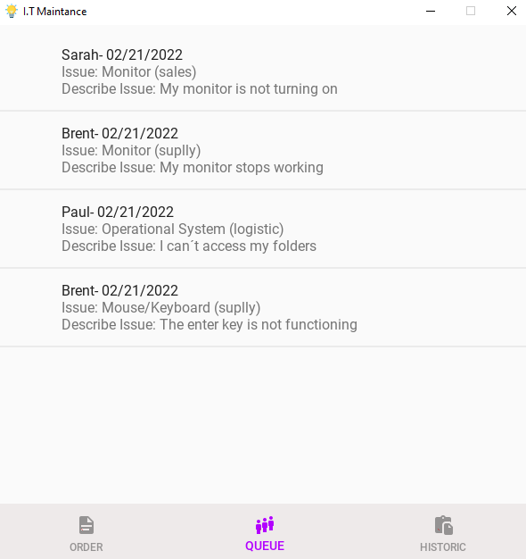
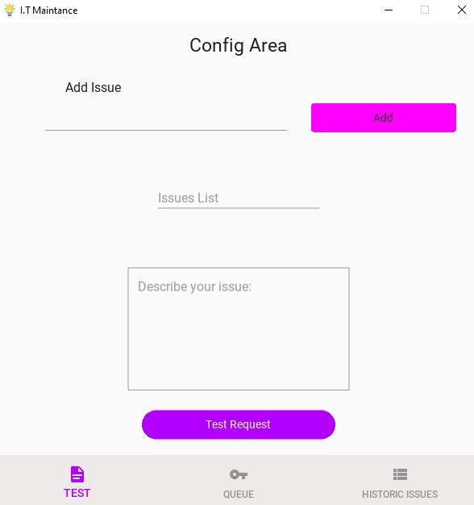
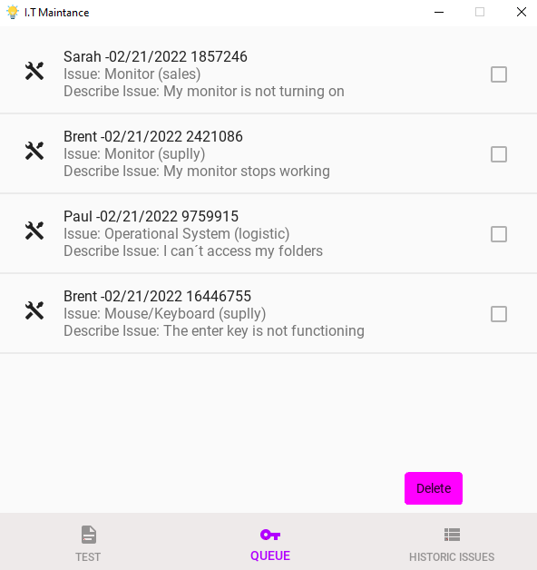
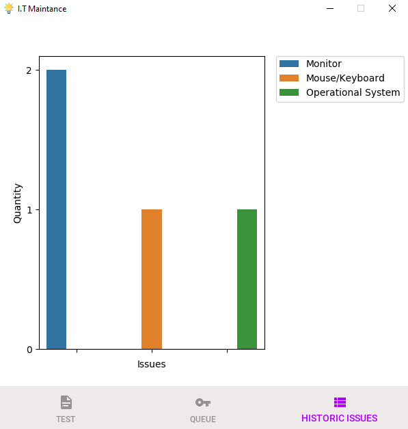

I.T Maintance
-------------


Application in Python to control the maintenance of computers in sectors of a company with a realtime database -_Firebase._

----------------
The Project
-

The idea of this project is that the employees of a company can make maintenance requests when necessary.
In addition, they can follow the progress of calls within a screen called "Queue".

Each user registers with their name, email and company sector.
From there, it can execute a call and be recognized in the request queue.

The maintenance team can access this list and schedule the execution of each request. In addition to tracking case statistics in real time to assist in decision making

Dependencies
=
See _requirements.txt_

Installation
=

This application was packaged using PyInstaller.

For more information about PyInstaller installation, visit: [https://pyinstaller.readthedocs.io/en/stable/installation.html](https://pyinstaller.readthedocs.io/en/stable/installation.html "optional-title")
***

After installing all the above dependencies, install pyinstaller:
```
pip install pyinstaller
```

Open the command prompt terminal, activate your virtual environment and go to the folder that contains your project files _main.py_ and _main.kv_.

Once that's done, type:
```
pyinstaller --onefile main.py
```

This will be created:

- 1 folder calling **_build_**
- 1 folder calling **_dist_** - with the executable file
- 1 _main.spec_ file - with application settings

Setting the App
=
Click on the _main.spec_ file

Note: If you are not packaging an application that uses kivyMD, remove the second import
```from kivymd import hooks_path as kivymd_hooks_path```
and change the line ```hookspath=[]```. Otherwise, skip this part.

```
# -*- mode: python ; coding: utf-8 -*-

from kivy_deps import sdl2, glew
from kivymd import hooks_path as kivymd_hooks_path   <-----

block_cipher = None


a = Analysis(['main.py'],
             pathex=[],
             binaries=[],
             datas=[('main.kv', '.'), ('./assets/*.gif','assets'),('./assets/*.ico','assets'),('./assets/*.png','assets')],
             hookspath=[kivymd_hooks_path],   <-----
             hiddenimports=[],
             hooksconfig={},
             #...
 )
```

After all this, save everything and run the code above in the terminal: 
````
pyinstaller main.spec
````

Once you're done, go back to the _**dist**_ folder and run the _main.exe_ file. Your application should start normally


FIREBASE SETTINGS
==
- Register at [https://firebase.google.com/](https://firebase.google.com/ "optional-title") 
- Create a new project
- Follow the steps for configuration

After that, inside the console from Firebase:
- Set a new ``` Web``` application
- Register your app
- Click in ```Realtime Database``` on the left side of the console and ```Create Database```
- Follow the steps for configuration.

At this point your realtime database has been created. 

Go to ```Project Overview``` at the left side of the console and click on the gear icon. Select ```Project settings```.
In```General```tab, scroll down the page and search for the following items:
```
{
"apiKey": " project api key ",
"authDomain": " project authDomain ",
"databaseURL": " project databaseURL ",
"storageBucket": " project storageBucket "
}

```
*Note: If ``"databaseURL": " your project databaseURL "``does not appear, refresh the page and wait a few seconds.

Replace these values inside the _db.py_ file:
   ``` 
class LogData:
        def __init__(self):
            self.config = {
                "apiKey": " project api key ",
                "authDomain": " project authDomain ",
                "databaseURL": " project databaseURL ",
                "storageBucket": " project storageBucket ",
            }
```
From now on, your project is created, with a database connected.It still lacks the configuration of the rules of access to the database.

Firebase Rules of Database
=

Click on ```Realtime Database```at the left side of the console and choose ```Rules```tab.

Edit the rules to:
````
{
  "rules": {
    "users":{
       "$uid": {
        // Allow only authenticated content owners access to their data
        ".read":"auth != null && auth.uid == $uid",
        ".write":"auth != null && auth.uid == $uid"
        }
    },
    "issues":{
       ".read":"auth != null",
       ".write":"auth != null"
    },
            
    "requests":{
        ".read":"auth != null",
        ".write":"auth != null"
    },
         
     "requests_historic":{
        ".read":"auth != null",
        ".write":"auth != null"
    },
      
      "admin":{
        	// Allow only authenticated admin access to data
        	// put the email that will be the administrator. Example:
        ".read":"auth != null && auth.token.email == 'admin@mycompany.com' ",
        ".write":"auth != null && auth.token.email == 'admin@mycompany.com' "
        }
    }        
}
````
**Note: To configure the app admin, change the ```theauth.token.email == 'admin@mycompany.com'``` from read and write to the email that will be the admin created in ```Authentication```**

For more information about firebase rules, see: [https://firebase.google.com/docs/database/security](https://firebase.google.com/docs/database/security "optional-title")

Your application is ready to run!


Screens
=

---

#### Client Side Screens

_Login_
-



_SignUp_
=


_Request Window_                                                                                                          
=                                                                                                                          

On this screen, the user points to which category of problem he requires assistance and details of what happened.  

                                                                   

Queue
=

Here, users can follow the progress of their requests



----

#### Admin I.T Side Screens

Config Area
=
In this part, the administrator can enter new issues, view the correct entry in the issues list, and do a test submission to make sure everything is working.

  

QUEUE
=
In this area, the administrator can see the requests and as he solves the problems, he can remove them from the queue. The database is automatically updated and users can follow the queue in real time.



Historic Issues
=

To assist in decision making, there is an area with problem statistics. Thus, it is possible to evaluate recurring problems, assess costs and prevent future problems.




Documentation
=
KivyMd

* See documentation at [https://kivymd.readthedocs.io](https://kivymd.readthedocs.io "optional-title")

Kivy
* See documentation at [https://kivy.org/doc/stable/](https://kivy.org/doc/stable/ "optional-title") 

License
=
KivyMD and kivy are released under the terms of the [MIT License](License/license "optional-title").

